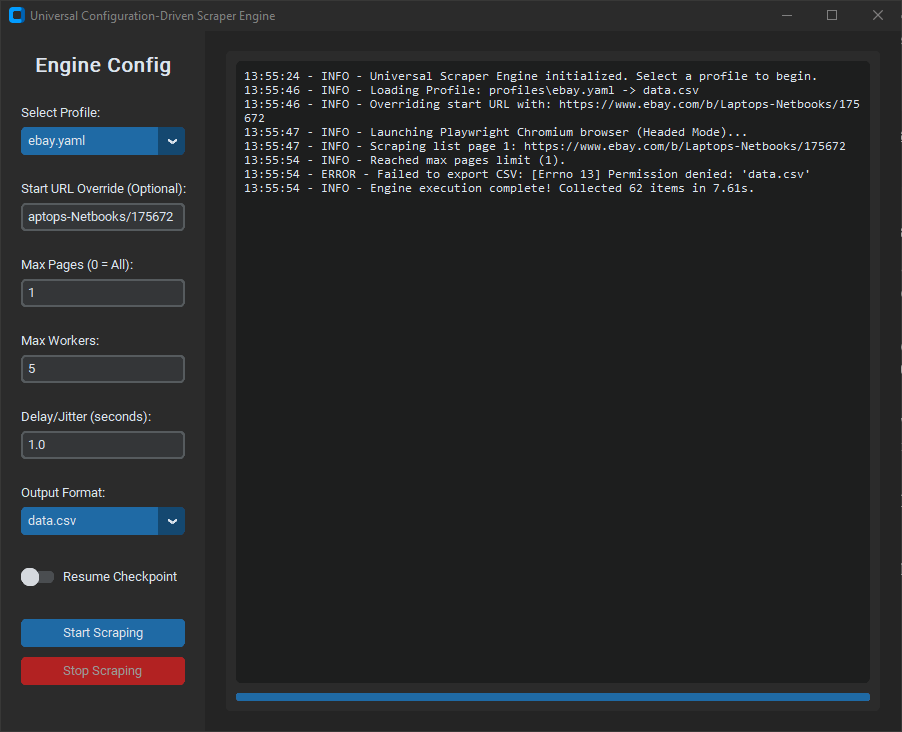

# Universal Web Scraper (Playwright Edition)


An advanced, configuration-driven Python web scraper utilizing Playwright to extract data from modern, JavaScript-heavy websites like eBay.

## What it does
This scraper is a **Universal Configuration-Driven Engine**. Instead of hardcoding HTML tags (like `<h3>` or `class="price"`), the engine reads declarative YAML "Profiles" which define the CSS selectors for the target site. This means you can scrape a completely new website without writing a single line of Python code—you just write a small YAML profile!

By default, this repository comes with profiles for:
- `ebay.com` (Extracts laptop titles, prices, and item URLs)
- `books.toscrape.com` (Extracts title, price, rating)
- `quotes.toscrape.com` (Extracts text and author)

## Advanced Architecture
This project features an enterprise-grade data extraction architecture:
- **Headless Browser Automation**: Powered by `playwright` to natively execute JavaScript and render client-side generated DOMs exactly like a real browser.
- **Bot Mitigation Evasion**: Integrates `playwright-stealth` (a port of `puppeteer-extra-plugin-stealth`) to bypass intense bot protections and CAPTCHA intercepts.
- **Dynamic Schemas**: SQLite tables, CSV headers, and JSON keys are automatically generated based on the fields defined in the loaded profile.
- **Robust Wait Strategies**: Actively waits for network idle states and dynamic CSS selectors (`page.wait_for_selector`) to accurately scrape lazy-loaded lists and skeleton loaders.
- **Error Quarantining**: Faulty records don't crash the script—they are logged as warnings and written to a separate `errors.csv` for inspection. 
- **State Checkpointing**: Supports a `--resume` flag that loads visited URLs from a profile-specific `.scrape_state.json` file, allowing you to restart aborted long-running scrapes.
- **Graphical Interface**: Includes a modern, multi-threaded `customtkinter` GUI to manage profiles, stream logs in real-time, and cleanly interrupt execution.

## Installation

1. Clone the repository.
2. Create a virtual environment:
   ```bash
   python -m venv venv
   source venv/bin/activate  # On Windows use: venv\Scripts\activate
   ```
3. Install the dependencies:
   ```bash
   pip install -r requirements.txt
   ```
4. Install the Chromium binaries for Playwright:
   ```bash
   python -m playwright install chromium
   ```

## Usage

### Using the GUI
A modern graphical interface is included. It features a sleek dark mode, live progress bars, and a scrolling log console.
```bash
python gui.py
```

### Using the CLI
Run the scraper directly from the terminal using a specific profile.

```bash
python scraper.py --profile profiles/ebay.yaml --output data.csv
```

**CLI Arguments**
- `--profile`: Path to the YAML profile defining the site's structure (Required)
- `--config`: Path to YAML engine config file
- `--pages`: Limit the number of pages to scrape (default: all pages).
- `--output`: Output filename. Supports `.csv`, `.json`, and `.db` extensions (default: `data.csv`).
- `--delay`: Base delay/jitter between requests in seconds to be polite (default: `1.0`).
- `--retries`: Number of retries for failed requests (default: `3`).
- `--resume`: If set, continues scraping from the last checkpoint instead of starting over.
